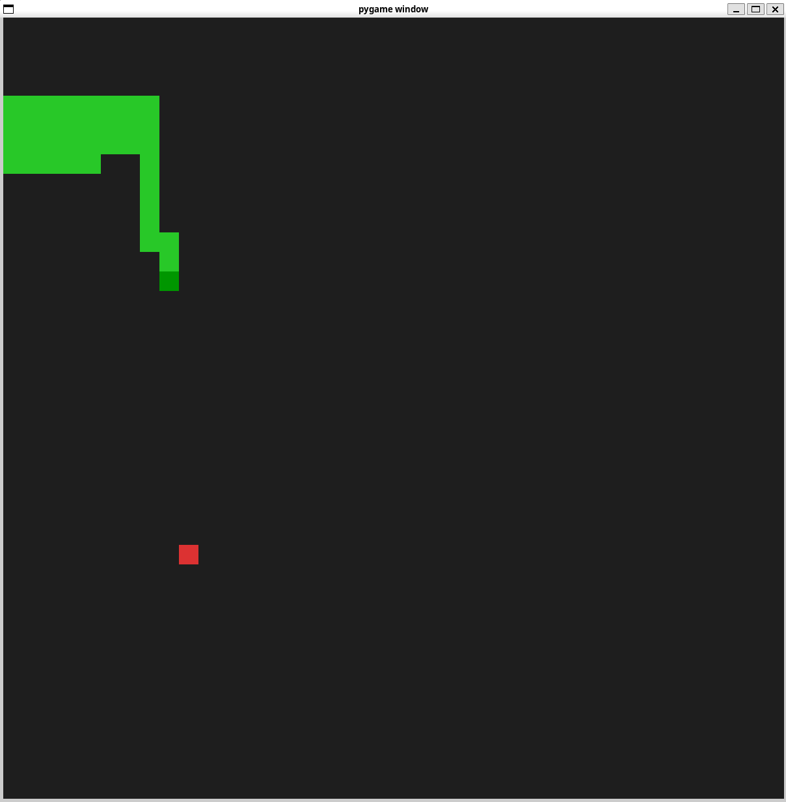

# RL-Snake

A reinforcement learning Snake project. The environment is implemented in C++ via pybind11 and wrapped in Python. It provides PPO, REINFORCE, and DQN training/evaluation, plus manual play rendering.

## Environment & Dependencies
- Python: 3.10.18
- numpy: 2.2.6
- torch: 2.7.1+cu128
- matplotlib: 3.10.7
- pygame: 2.6.1
- pybind11: 3.0.1

Install example:
- `python -m pip install -U numpy torch matplotlib pygame pybind11`

## Build C++ Extension
- From repo root:
  - `python setup.py build_ext --inplace`
- Produces `rl_snake/snake_env_cpp*.so`. Use `from rl_snake import SnakeEnv` in Python.

## Project Structure
- `rl_snake/` environment package
  - `env.py` Python wrapper using the C++ extension; provides `reset/step/render`
  - `snake_env_cpp*.so` compiled extension module
- `cpp/` C++ source
  - `snake_env.cpp` environment logic and pybind11 bindings
- `agents/` RL algorithms
  - `reinforce_agent.py`, `ppo_agent.py`, `dqn_agent.py`
- Training scripts
  - `reinforce_train.py`, `ppo_train.py`, `dqn_train.py`
- Utilities
  - `scripts/manual_play.py` manual play
- Others
  - `setup.py` build and packaging config
  - `models/` model checkpoints (examples)
  - `imgs/` training curves (examples)

## Usage

### Train
- PPO:
  - `python ppo_train.py --mode train --episodes 20000 --size 40 --save ./models/ppo_snake_torch.pt --update_freq 2048 --epochs 4 --batch_size 128`
- REINFORCE:
  - `python reinforce_train.py --mode train --episodes 10000 --size 30 --save ./models/reinforce_snake_torch.pt`
- DQN:
  - `python dqn_train.py --mode train --episodes 5000 --size 30 --save ./models/dqn_snake_torch.pt`

Common args:
- `--episodes` total episodes; `--size` board size; `--max_steps` max steps per episode
- `--save` checkpoint path; `--seed` RNG seed
- PPO only: `--update_freq`, `--epochs`, `--batch_size`

### Resume Training
- PPO:
  - `python ppo_train.py --mode train --save ./models/ppo_snake_torch.pt --load ./models/ppo_snake_torch.pt --resume 1`
- REINFORCE:
  - `python reinforce_train.py --mode train --save ./models/reinforce_snake_torch.pt --load ./models/reinforce_snake_torch.pt --resume 1`
- DQN:
  - `python dqn_train.py --mode train --save ./models/dqn_snake_torch.pt --load ./models/dqn_snake_torch.pt --resume 1`
- Note: if loading fails or shape mismatch occurs, it logs and continues; save dirs are auto-created.

### Evaluate & Visualize
- PPO:
  - `python ppo_train.py --mode eval --eval 10 --size 40 --render 1 --save ./models/ppo_snake_torch.pt`
- REINFORCE:
  - `python reinforce_train.py --mode eval --eval 3 --size 30 --render 1 --save ./models/reinforce_snake_torch.pt`
- DQN:
  - `python dqn_train.py --mode eval --eval 3 --size 30 --render 1 --save ./models/dqn_snake_torch.pt`
- Curves saved under `imgs/`: `imgs/ppo_scores.png`, `imgs/reinforce_scores.png`, `imgs/dqn_scores.png`

## Demo Images
- Demo: 

### Manual Play
- `python scripts/manual_play.py --size 10 --fps 10 --scale 30`
- Controls: arrow keys; `Esc` to quit

## Code Overview
- Environment (C++/pybind11): `snake_env_cpp` implements Snake logic and exposes
  - `reset()`, `step(action)`, `get_snake()`, `get_head()`, `get_food()`, `get_direction()`, `set_direction(...)`
  - `reset()` returns `numpy.float32` observation of length 36; `step()` returns `(obs, reward, done, info)`
  - Rewards: food bonus, Manhattan-distance shaping, turn penalty, starvation termination
- Python wrapper & rendering:
  - `rl_snake/env.py` binds C++ env to Python and renders via `pygame`
- Algorithms:
  - `agents/ppo_agent.py` policy-value nets, GAE, clip loss
  - `agents/reinforce_agent.py` REINFORCE on-policy policy gradient
  - `agents/dqn_agent.py` DQN with dropout, cosine LR, target network

## Troubleshooting
- `snake_env_cpp not found`: build first `python setup.py build_ext --inplace`; or `pip install -e .`
- Extension import path: prefer `from rl_snake import SnakeEnv`; wrapper includes a fallback import
- Load errors: ensure checkpoint matches current hyperparameters; otherwise retrain

For Chinese documentation, see `README.zh.md`.